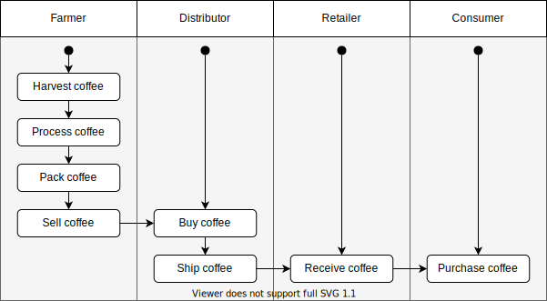
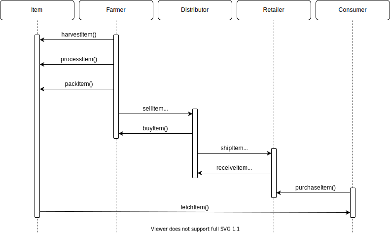
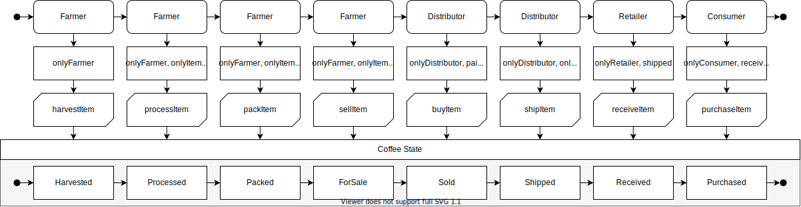
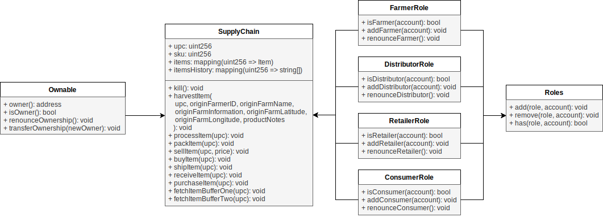

# Supply chain & data auditing

_Note: to properly work with the Rinkeby test network you will need to create a `.env` file in the `project-6` folder containing the `INFURA_KEY` and the `MNEMONIC` environment variables._

This repository containts an Ethereum DApp that demonstrates a Supply Chain flow between a Seller and Buyer. The user story is similar to any commonly used supply chain process. A Seller can add items to the inventory system stored in the blockchain. A Buyer can purchase such items from the inventory system. Additionally a Seller can mark an item as Shipped, and similarly a Buyer can mark an item as Received.

---

**Contract creation transaction ID:** [`0xa4193f37abaa79a0df3fccfe9b441c8324056c2feed6df7338eb0a32839b43e7`](https://rinkeby.etherscan.io/tx/0xa4193f37abaa79a0df3fccfe9b441c8324056c2feed6df7338eb0a32839b43e7)

**Contract address:** [`0xeba2ee11b0751cd6d4aefe06546f54b67c9bd807`](https://rinkeby.etherscan.io/address/0xeba2ee11b0751cd6d4aefe06546f54b67c9bd807)

## UML Diagrams

### Activity Diagram



### Sequence Diagram



### State Diagram



### Class Diagram



## Getting Started

These instructions will get you a copy of the project up and running on your local machine for development and testing purposes. See deployment for notes on how to deploy the project on a live system.

### Prerequisites

Please make sure you've already installed ganache-cli, Truffle (v4) and enabled MetaMask extension in your browser.

### Installing

A step by step series of examples that tell you have to get a development env running

Clone this repository:

```
git clone https://github.com/Dabolus/nd1309_coffee_supply_chain
```

Change directory to `project-6` folder and install all requisite npm packages (as listed in `package.json`):

```
cd project-6
npm install
```

Launch Ganache:

```
ganache-cli -m "spirit supply whale amount human item harsh scare congress discover talent hamster"
```

Your terminal should look something like this:


In a separate terminal window, Compile smart contracts:

```
truffle compile
```

Your terminal should look something like this:


This will create the smart contract artifacts in folder `build/contracts`.

Migrate smart contracts to the locally running blockchain, ganache-cli:

```
truffle migrate
```

Your terminal should look something like this:


Test smart contracts:

```
truffle test
```

All 10 tests should pass.


In a separate terminal window, launch the DApp:

```
npm run dev
```

The DApp User Interface when running should look like...


## Built With

- [Ethereum](https://www.ethereum.org/) - Ethereum is a decentralized platform that runs smart contracts;
- [Truffle Framework](https://truffleframework.com/) - Truffle is the most popular development framework for Ethereum with a mission to make your life a whole lot easier;
- [Web3.js](https://web3js.readthedocs.io/) - A collection of libraries that allow to easily interact with an Ethereum node.
